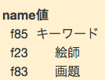

現在Saoriのv0.5を作っていますが, どうやらテーブルが正しく表示されないです.

```markdown
|name|値|
|:-:|:-:|
|f85|キーワード|
|f23|絵師|
|f83|画題|
```
上記の記述をしたら以下の様なテーブルが生成されました.



罫線が入っていないので,テーブルとしてわかりにくくなっています. 今のところ原因がわかっていません. Atomの上では正しく表示されているので記述に間違いはないのではないかとは思います. cebe/markdownを使ってMarkdownを変換しています. とりあえず他のライブラリを使ってみてどう表示されるのか試してみます. あとHTMLも確認してみたいと思います.

ちなみにv0.5.x-devでは記事とユーザページ(contents/page/NAME.md)の画像ファイルのパスの書き換えはできるようになりました. 
