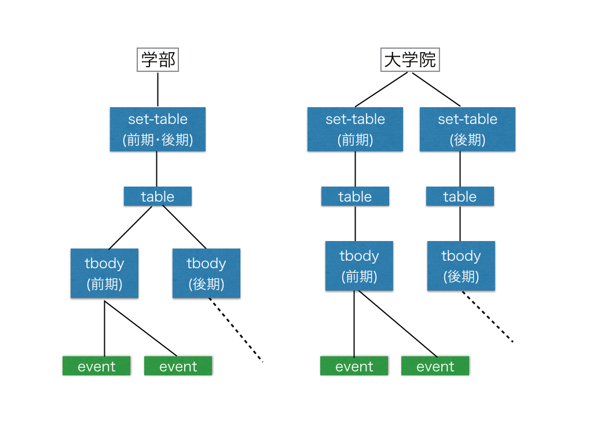

[前の記事](/article/2016/06/ritsucal/)でPHPを使って,学年暦のスクレイピングを行うライブラリの紹介をしたので,今回はそれを作ったことの話をします. スクレイピングは[fabpot/goutte](https://github.com/FriendsOfPHP/Goutte)を使用しました

## ページをローカルで動かす
おそらくコード書いて1回では成功できず,何度も失敗すると思うので,負荷を与えないように対象のページをダウンロードしてローカルで動かしてそこにスクレイピングをしましょう.  
Chromeで 'Command(Control) + S'でダウンロードできます. ファイル名はindexでいいです. 次に動かし方ですが, PHPのビルトインサーバを使いましょう.
```sh
cd public
php -S localhost:8000
```
詳しくは[ここで](http://php.net/manual/ja/features.commandline.webserver.php).

## スクレイピングをする
### タイトル
ブラウザで上記のlocalhostにアクセスをして学年暦のタイトル(ページのタイトルではない)を探します.
1. 2016年度　立命館大学　学年暦

2. 2016年度　立命館大学大学院　学年暦 セメスター制
  （法学研究科、経済学研究科、経営学研究科、社会学研究科、文学研究科、国際関係研究科、政策科学研究科、応用人間科学研究科、言語教育情報研究科、公務研究科、スポーツ健康科学研究科、映像研究科、先端総合学術研究科）

3. 2016年度　立命館大学大学院　学年暦 セメスター制
  （理工学研究科、情報理工学研究科、生命科学研究科、薬学研究科）

4. 2016年度　立命館大学大学院　学年暦 セッション制
（テクノロジー・マネジメント研究科、経営管理研究科）

5. 2016年度　立命館大学大学院　学年暦
  （法務研究科）

この5つがあるので,これをタイトルとして,5つの学年暦を取得します. Chromeで右クリック→検証で構造を確かめられるので,見に行くとclass="mod-title type4"が割り振られているので
```php
$title = $crawler->filter('.mod-title.type4')->eq($i)->text();
```
で得られます.

### 年度
年度ですが,これはタイトル内に書かれているので[preg_match()](http://php.net/preg_match)を使って｢2016｣を拾ってあげます.

### 各学年暦
ここからがスクレイピングするのには面倒な構造になっています.というのも, 学部と大学院では構造が異なっているのです. 学部の方は, mod-wysiwyg > set-table > table内にtheadとtbodyが2つ(前期･後期)あります. 一方, 大学院の方はmod-wysiwyg > set-table が2つ(前期･後期)です.  
eventはclass="event"ではなくテーブルの要素(イベント名･月･日)だと考えてください. mod-wysiwyは略.



これは不親切ですね. しかし,うまいこと下から順に配列を結合させていくと,5つの学年暦ができます. 考え方としては, 各学年暦にはset-tableが複数あり,tableの中にもtbodyが複数あることを前提に作るってことです.  結合やイベントのことなどは[コード](https://github.com/hrgruri/ritsucal/blob/master/src/Client.php)を見てもらうほうがいいかと.  

同じ日の行事はまとめられているので注意してください.
