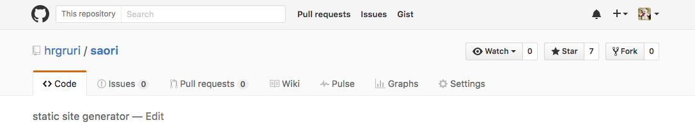

PHPカンファレンス関西 2016に参加をして, ブログを書くまでがカンファレンスだと言われたので書きたいと思います. 初めてのIT系イベント, 初めてのLT, 初めての懇親会でした. 先に断っておきますがカンファレンスでの基調講演やセッションの感想ではなく個人的な話が主です.

# 当日まで
## カンファレンスに参加
そもそもPHPカンファレンス関西というのを知ったのが, 2015年のカンファレンスの動画をYouTubeで見つけた時です. なので知ってから1年も経っていません.  
東京は行くのが厳しいですが, 大阪なら行けるということで2016年のPHPカンファレンス関西には参加したいと思いました.
<blockquote class="twitter-tweet" data-lang="ja">
PHPについて勉強しなきゃ。カンファレンス・関西を見に行ってみたい
&mdash; 柊木 (@hrgruri) <a href="https://twitter.com/hrgruri/status/675512116514701312">2015年12月12日</a></blockquote>

その時点ではまだ何月何日に開催されるのかわかりませんでした.
月日は流れ, 開催日が発表されてそれを確かめると7月16日. 予定も空いているので参加を決意しました. この時点ではただ単にカンファレンスを聞きに行くだけの予定でした.  
一応,少しずつですが[hrgruri/saori](https://github.com/hrgruri/saori)の開発をしていました.  

## LT参加を決意
6月になってもまだLTの応募がありました. セッション枠は募集終了していたと思います.
<blockquote class="twitter-tweet" data-lang="ja">
カンファレンスのLT募集のフォームがまだあるってことは、LT募集しているのかな？
&mdash; 柊木 (@hrgruri) <a href="https://twitter.com/hrgruri/status/740189166785306624">2016年6月7日</a></blockquote>

カンファレンスに参加をするんだったら話したいなと思い, 思い切ってLTの応募をしました. 落選するだろうなと思っていたのですが, 6月16日に当選メールが来て喜ぶと同時に(まだまだ先ですが)緊張しました.    

## 前日
<blockquote class="twitter-tweet" data-lang="ja">
デモをやったら5分で収まるかな? 怪しい
&mdash; 柊木 (@hrgruri) <a href="https://twitter.com/hrgruri/status/753777772007264256">2016年7月15日</a></blockquote>

<blockquote class="twitter-tweet" data-lang="ja">
CDN使っているのでオフラインだとデザインがかなり壊れるので、デモ用にダウンロードしてパスを書き換えた状態のものを用意しておく
&mdash; 柊木 (@hrgruri) <a href="https://twitter.com/hrgruri/status/753920059337281536">2016年7月15日</a></blockquote>

# 当日
## 午前の部
開場が10時からで,大阪駅には9時30分ごろに着いていました. のんびり会場まで歩いて行きながら大阪の車と人の多さに怯えていました.
<blockquote class="twitter-tweet" data-lang="ja">
田舎民なので大阪に恐怖している
&mdash; 柊木 (@hrgruri) <a href="https://twitter.com/hrgruri/status/754117879319044098">2016年7月16日</a></blockquote>

会場(7階)で受付を済ませました. スピーカーは専用の場所があり, 名前を言うだけで受付が済むのは良かったです.
<blockquote class="twitter-tweet" data-lang="ja">
なんとか田舎民が会場に着きました <a href="https://twitter.com/hashtag/phpkansai?src=hash">#phpkansai</a> <a href="https://t.co/wMLLK5ZZdg">pic.twitter.com/wMLLK5ZZdg</a>
&mdash; 柊木 (@hrgruri) <a href="https://twitter.com/hrgruri/status/754119238122479616">2016年7月16日</a></blockquote>

午前の部が終わった時にメインホールでWi-Fiが使ええますよというアナウンスが有りました. LTのデモでは, デモ用のブログを生成して終わりにしようと考えていたのですが, 実際にgit pushしてLTの最中にブログをアップロードできる可能性が出てきました.

## 午後の部
お昼ごはんを食べに行き, 会場の戻ってくると休憩場所がある8階に行きました. カンファレンスに来たのだからセッションを聞きに行くべきだですが, LTのデモの内容とスライドを変えたかったので, その作業を行いました. 当初,スライドは2分話して, 2分デモをして, 1分話すという考えのもと作っていました.
<blockquote class="twitter-tweet" data-lang="ja">
2分話して, 2分デモして, 1分話すでいいのかな. 話すのもデモも2分で終わるようにしないと
&mdash; 柊木 (@hrgruri) <a href="https://twitter.com/hrgruri/status/753783193447206912">2016年7月15日</a></blockquote>

しかし実際にブログを更新できそうだったのと, デモの内容を変えることでデモにかける時間が変わると思ったので, デモを最後にすることにしました. そんなわけで,スライドを少し変えてデモ用に簡単な記事を予め作っておき, シェルスクリプトでコピーできるようにしていました. そのあと簡単にですがLTの練習をしていました. LTの練習がある程度済んだらセッションを見に行きました.

## LT(ライトニングトーク)
セッションがすべて終了すると,少しの休憩を挟み, いよいよメインホールでLTです. プロジェクターのチェックを済まし,上手側でLTのスピーカーの人たちは待機していました. 例年だとLTの順番はくじなどでランダムに決めていたようですが, 今年は[タイムテーブル](http://conference.kphpug.jp/2016/timetable/)の順で行うことになりました. 私の順番は5番目でした.  

他の方のLTを見ながら, 待機場所でスライドに不備がないことを確認していました. 前の方が終わり, いよいよ私の番になったのでステージにあがり,パソコンを設定していると空席があるということで席の誘導が行われ, その後, 始まりました.  
自己紹介で大学生だということとIT系のイベント自体初参加でLTも初めてだということを言ったら拍手をいただきました. スライドの説明はスライドをアップロードしているので詳しくは省略します.  

内容としては｢github.io｣と既存の静的サイトジェネレータに少し触れて, ｢[Saori](https://github.com/hrgruri/saori)｣の話をしました. 使い方や設定などに関してはあまり話せませんでした. 簡単にですが使い方を書いたのでSaoriを使いたい方は[こちら](/repository/saori)をご覧ください.  
時間が十分に余ったので, 最後にデモを行いました. デモの内容は私が実際に使っている[ブログ](https://hrgruri.github.io/)に記事を投稿するというものです.   
少しの内容ですが実際に書くのは(時間的に)怖かったので予め用意していました.  
### デモの内容
1. 記事｢demo｣用のベースファイルを生成  
｢blog post demo｣と入力してベースとなるディレクトリとファイルを作成しました. ｢blog｣はaliasで｢blog='php ~/Desktop/blog/main.php'｣です.

2. ファイルをコピー  
用意していた記事をコピーする際に｢cp from to｣とする時間がもったいなかったので予め作っていたシェルスクリプトでコピーしました.

3. ブログを生成  
｢blog make｣と入力してブログを生成します. これによりlocalhostで動かすためのものとusername.github.ioで公開するものとが生成されます.

4. localhostで確認  
GitHubに上げる前のlocalhostで確認をします. PHPのビルトイン サーバを利用してWebブラウザで確認をしました.

5. 実際に公開  
公開するためにadd, commit , pushをしました. ｢g add｣とかしていましたがgはgitのaliasです.

6. hrgruri.github.ioを確認  
実際に公開されたページをWebブラウザで見に行きました.

Saoriについて話をしてデモもでき,最低限の言いたいことが言えたあたりで銅鑼が鳴り,初のLTが終了しました. 実は手元のiPhoneで時間を図っていたのですが, LT中に1度も見ていなかったです.  

そんなわけで今回のLTで
- github.ioは無料
- GitHubが緑になる
- PHP最高
- Saoriはいいよ

ということが伝わっていれば幸いです. ちなみにデモの際に投稿したのは[これ](http://hrgruri.github.io/article/2016/07/demo/)です.

### LTの感想+α
デモではタグ, リンク, 最近の記事の掲載などに触れることができて良かったです. しかし,プッシュをした時にすぐに終わらないのは本当に焦りました. 微妙なところで終わるのかもしれなかったですが, LTならではのアクシデントでいい経験だったと思います.  
始まるまでは拍手や笑いが無いものになってしまうのではないかと不安でしたが, LT冒頭の自己紹介で拍手をいただき不安と緊張がとても和らぎました. LT中も笑いがあり, やっていて楽しかったです.   

私のLTを聞いてくださった皆さんとLTをさせてくださった実行委員の方々に感謝したいと思います. ありがとうございました.
<blockquote class="twitter-tweet" data-lang="ja">
初イベント, 初LTは最高でした <a href="https://twitter.com/hashtag/phpkansai?src=hash">#phpkansai</a>
&mdash; 柊木 (@hrgruri) <a href="https://twitter.com/hrgruri/status/754220651079012352">2016年7月16日</a></blockquote>

こちらが私のLT資料です.

## 懇親会
LTと写真撮影が終わったら, 懇親会の準備のため18時まで時間があったので8階で待機となりました. Twitterを見ているとスライドのアップロードがいくつもあったので, 私もすることにしました.Speaker Deckでアカウントを作成し, アップロードをしている最中に｢LTしていた人ですよね｣と声をかけてくださった方々がいました. その人達と懇親会が始まるまでいろいろと話しをさせていただき, 懇親会でも引き続き話をさせていただきました.  

懇親会では飲んだり食べながらしながらいろいろな人と話をさせていただきとても楽しかったです. 知らなかったWAFのことを教えていただいたり, WordPressの話をしたりと私が知らなかったことを聞くことができました.  

懇親会のLTは話をしながら後ろのほうで聞いていました. 懇親会LTは3分というとても短い時間でしたが面白いものばかりで会場も大盛り上がりでした.  
LTのあとはじゃんけん大会が行われました. 11名が景品をもらえるとのことでした. 結果は11名の中に残り,カンファレンスのTシャツを頂きました.
<blockquote class="twitter-tweet" data-lang="ja">
初カンファレンス、初LT、初懇親会で景品もらえました。 <a href="https://twitter.com/hashtag/phpkansai?src=hash">#phpkansai</a> <a href="https://t.co/f3rOMxLcEp">pic.twitter.com/f3rOMxLcEp</a>
&mdash; 柊木 (@hrgruri) <a href="https://twitter.com/hrgruri/status/754264454884274176">2016年7月16日</a></blockquote>

懇親会の終わりごろに基調講演をされたhirakuさんと少し話をさせていただきました. メルカリ様のステッカーをいただきました. ありがとうございます. パソコンにでも貼りたいと思います.  

# 最後に
こうして初めてのカンファレンス, 初めてのLT, 初めての懇親会が終わりました. 懇親会での話やTwitterを見てみると｢LT,良かったよ｣というのがあったので嬉しいです. デモも好評で良かったです. [リポジトリ](https://github.com/hrgruri/saori)を見てみるとStarがありました. ありがとうございます.

Twitterで[#phpkansai](https://twitter.com/search?q=%23phpkansai)を見ているとLTで話した内容(Saori)以外のことが少し話題になっていました. それは私がデモの時に使った｢g (git)｣です. Twitterを見ている限り｢git｣はエイリアスで｢g｣としている人は多い気がしますが少し会場がざわついていました. 少しでもストレスを無くすために｢g｣にするはおすすめです.

カンファレンスが始まる前から気になっていたのですが,私以外にも大学生は参加していたのでしょうか. 私だけということはないとは思いますが,見かけませんでした. LTの冒頭で大学生がいるか聞いておけば良かったかなと今思う.

## カンファレンスに参加したい学生へ
PHP初心者の学生でも参加する価値はあると思います. そもそも私自身もPHPを使い始めてそれほど経っていませんし, 今回LTで話したことも静的サイトジェネレータの話であって, PHPの主な使い方であるWebアプリケーション関係の話ではないです.  
スライドでもPHPのコードはたったの4行しかありませんでした. PHPを触ったことがない人でもPHP(Saori)を使ってブログを公開することで, PHPに興味を持って使い始める学生が出てきてくれたら良いなと思います.  
また,今回のカンファレンスでは初心者向けのセッションやDBに関するセッションなど, PHPを知らなくても楽しめるものがいくつもあったと思います.  
LTをしたことで思ったのが, みんな優しかったです. LT後にも話しかけてくださる方々がいてとても良いカンファレンスでした.  
カンファレンスの参加料は1000円ですが, 学割(先着)があり今回のカンファレンスは無料でした. ちなみにLTスピーカーは招待されるので本編チケットを買う必要なし.

最後になりましたが, カンファレンスに出席した皆様, LTを聞いてくださった皆様, 懇親会で話をしてくださった皆様, 主催してくださった実行委員の皆様, そしてスポンサーの皆様のおかげで楽しいカンファレンスとなりました. ありがとうございました.

***
# その他
カンファレンスのスライドは,まとめてくださった方がおられるのでそちらを御覧ください.  
｢[PHPカンファレンス関西2016 スライドリンク集 #phpkansai - お？意外といけるやん！](http://ikkitang1211.hatenablog.jp/entry/2016/07/16/145657)｣  

TogetterにPHPカンファレンス関西2016まとめがあります.  
｢[PHPカンファレンス関西2016まとめ](http://togetter.com/li/1001000)｣

PHPカンファレンス関西に参加しようと考えた時に読んだ記事  
｢[ブラよろで学ぶPHPカンファレンス関西2014](http://www.sigesaba.com/2014/06/phpkansai2014-relay05.php)｣
