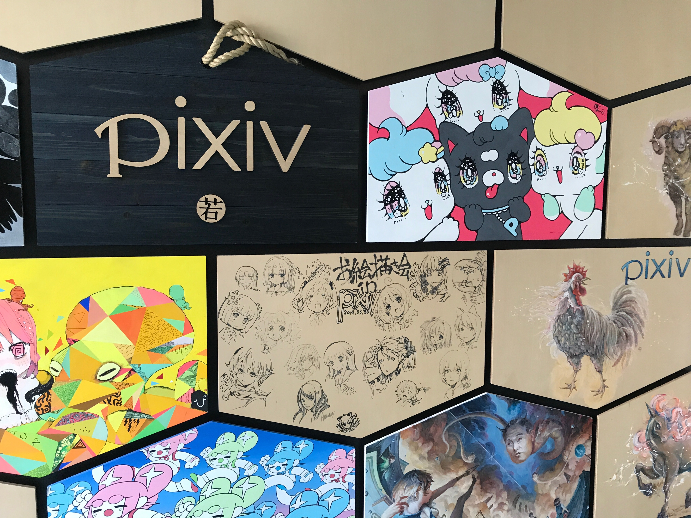

ピクシブさんのインターンに行ってきたのでそのお話です. [去年も参加](https://taniko.github.io/article/2016/09/summer_boot_camp_2016/)したので, 1年ぶり2度めのピクシブさんでのインターンでした.

## 参加するまで
### 選考について
GitHub選考が今年もあったので, それを使って応募しました. GitHub選考は, 履歴書とか書かなくていいのでおすすめです.  

1次選考が終わったらオンライン面接がありました. 内容は, なぜ(今年も)応募したのかや, 参加希望コースのこととか, コーディングテストとかです. コーディングテストに関しては, 好きな言語でやっていいとのことなので, もちろんPHPでやりました.  

エントリーから面接含めて2週間弱で, 参加させていただけることが決まりました.

### 前日
去年同様に, 初日の朝に滋賀から東京に行って, 最終日の夜に帰ろうとしていたのですが, 東京に住んでいる友達にお願いして, 泊めてもらえることになりました. おかげさまで移動がだいぶ楽になりました. 感謝です.

## やったこと
初日の午前中は, インターンの概要説明, 自己紹介, 機密保持契約とかをやっていました. 社員の方はもちろんなのですが, 参加しているインターンの人もすごい人ばっかりでした.

午後からは, 開発環境の構築から始まり, 実際に開発を行い始めました. 開発環境の構築なのですが, データが大きすぎるので, 開発用のサーバのコードを触って行うというものだったので, SSHとかの知識がほんの少し必要. セットアップの方法はまとめられているので, 基本的にはその通りにやっていけば行えました. SSHの公開鍵周りのことがあるので, GitHubに公開鍵を登録しておくと楽です.

開発なのですが, 今回, 私が参加したのは技術基盤コースというもので, pixivや他のサービスで利用されているライブラリやルーティングをリファクタリングなどが主な内容でした.

具体的には
- PDOから独自のライブラリに移行
- リファレンス渡しをなくす
- ユーザが原因のエラーのログレベルを修正
- とあるエラー時のログ用テーブルの設計とロギング用クラス作成

など. テストがないようなところはテストも作ったりしていました. 基本的にはPHPを触っていたのですが, エラーの再現をさせるためにフロント(TypeScript)のコードも読むことがありました.

GitHubにインターン生用のスナップショットがおいてあって, そこで開発していきました.  

流れとしては,
- コードを書く
- PRを送る
- コードレビューを受ける
- 本体(実際に運用されているリポジトリ)にマージされる
- デプロイ

といった感じです. 時々, 本体側で更新されたコードもまとめて降ってきました.  
チーム開発なので, リーベースしたり, コミットをまとめたりなどをすることがありました. 一度, PRをクローズ, スカッシュ, リベースなどをやってしまって, PRを再オープンするのに手間取って大変でした.  
インターン中にいくつかのPRがマージされました. 実際に本体でマージされてデプロイされる画面も見せていただきました.

最終日は, インターンの成果発表がありました. インターンはコース毎に分かれてやっていたので, 他のコースの人がどんなことをやっているのかは, その時まではよくわかっていなかったのですが, 皆さん機能追加やOSSへコントリビュートしたり楽しそうでした.  
あと, すべてが終わったあとにオフィス見学をさせていただきました.

## さいごに
開発業務以外にも, 全社ミーティング, インターン生向けの講義とかがあり, ピクシブさんの現状であったり, プロジェクトのこれからの方針とかも聞かせて頂きました.  

一緒に働かせていただいて, 周りの方々はすごい人ばかりだなと感じました. メンターの方々に相談すれば一緒に考えてくださり, とても親切な方々でした.

大変勉強になった5日間でした. ピクシブさんには大変お世話になりました. このような機会をいただき, ありがとうございました.
