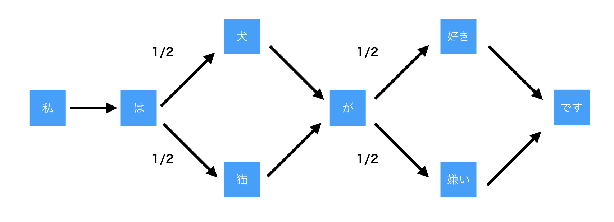
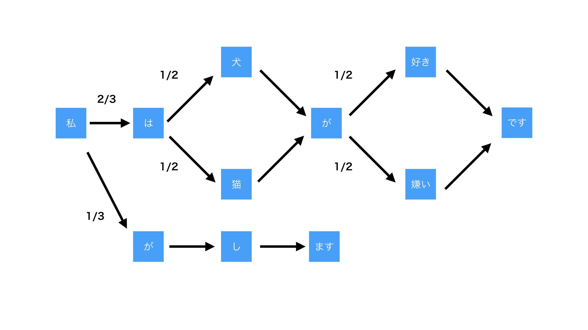
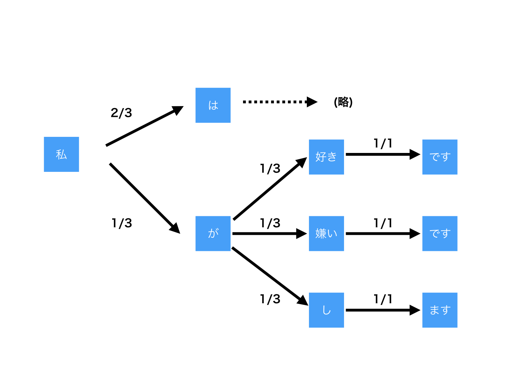

文章作成機(?)を作る方法をなるべく簡単(?)に説明したいと思います. とても, 無能なものです.  

## はじめに
どんなものかと簡単に説明すると, 複数の文章を元に, 文章を作成するというものです.  
PHPで雑に実装したので, それもどうぞ.
[https://github.com/taniko/udon](https://github.com/taniko/udon)

## 仕組みを雑に
まずはじめに, 元となるデータを用意します. 簡単にするために, 以下のような文章を用意します. 猫派の方はごめんなさい.

1. 私は犬が好きです
1. 私は猫が嫌いです

この2文を形態素解析をすると以下のようになったとします. MeCabとか使えばいいと思います.

1. 私 は 犬 が 好き です
1. 私 は 猫 が 嫌い です

これを1つの状態遷移図で表すと以下のようになります.

この状態遷移図から文章を生成してみます.

1. 私は犬が好きです (本来の文章)
1. 私は猫が嫌いです (本来の文章)
1. 私は犬が嫌いです (新たな文章)
1. 私は猫が好きです (新たな文章)

新たに2つの文章が得られました. 簡単ですね. そんなわけで, 以上, 文章作成機の仕組みでした.

## もう少し面白く
仕組み自体は, あまり変わりませんが, 次の状態を現在の状態のみに依存させると面白くなるので, それについての話です. 実装したのはこっち.  

以下のような3文があったとします.

1. 私 は 犬 が 好き です
1. 私 は 猫 が 嫌い です
1. 私 が し ます

これを状態遷移図に書き起こします.

今までの通りにやると, 以下の5文が生成できます.
1. 私は犬が好きです (本来の文章)
1. 私は猫が嫌いです (本来の文章)
1. 私がします (本来の文章)
1. 私は犬が嫌いです (新たな文章)
1. 私は猫が好きです (新たな文章)

もし, 次の状態を決めるのが, `現在の状態のみに依存`するとなると以下のような表と図ができます.  

|現在の状態|次の状態|確率|
|:--|:--|:--|
|私|は|2/3|
|私|が|1/3|
|は|犬|1/2|
|は|猫|1/2|
|犬|が|1/2|
|猫|が|1/2|
|が|し|1/3|
|が|好き|1/3|
|が|嫌い|1/3|
|し|ます|1/1|
|好き|です|1/1|
|嫌い|です|1/1|

こうすることで, 新たに以下のような文が生成できるようになります.
- 私が好きです
- 私が嫌いです

このように, `現在の状態のみに依存`させると, 新たな文章が作成できるようになりました. 実装するなら, 下の表みたいに, 文の頭に`BOS(Begin of Sentence)`, 文の終わりに`EOS(End of Sentence)`などを差し込んで, どの語から始めることができ, どの語で終わることができるのかを明確にした方がいいと思います.

|現在の状態|次の状態|確率|
|:--|:--|:--|
|BOS|私|3/3|
|ます|EOS|1/1|
|です|EOS|1/1|

ちなみに, 私のツイートから生成された文章はこんな漢字です.

<blockquote class="twitter-tweet" data-lang="ja">
記号とか品詞とか全く考えずにやるとこんな感じで, ゴミが生成されます. <a href="https://t.co/erAWuavniZ">pic.twitter.com/erAWuavniZ</a>
&mdash; たにこ (@hrgruri) <a href="https://twitter.com/hrgruri/status/1013721468583141376?ref_src=twsrc%5Etfw">2018年7月2日</a></blockquote>

おしまい.

## 調べると幸せになる用語
- MeCab
- mecab-ipadic-neologd
- マルコフ連鎖

## おわりに
PassCodeの"Tonight/Taking you out"を買いました. ライブDVDがほしかったので. (下の映像は入っていないです.)

PassCode - ONE STEP BEYON
<iframe width="560" height="315" src="https://www.youtube.com/embed/GObrpzFp2lA" frameborder="0" allow="autoplay; encrypted-media" allowfullscreen></iframe>

PassCode - Tonight
<iframe width="560" height="315" src="https://www.youtube.com/embed/YzNXj9a6blE" frameborder="0" allow="autoplay; encrypted-media" allowfullscreen></iframe>
