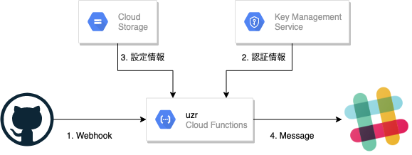

この記事は[DMMグループ Advent Calendar 2020](https://qiita.com/advent-calendar/2020/dmm) 13日目の記事です。

## 初めに
プルリクエストのレビュー依頼をSlack上で行っていました。
PRを作成するたびに、Slackで「レビューをお願いします」と書くのが面倒だったので、レビュー依頼を半自動化させました。  
BotによるDMもしくは、チャンネルへのメッセージによる通知を行います。

GitHubのPRまたはIssueにラベルをつけるとSlackにメッセージが飛びます。
個人、グループメンションに対応しています。Reviewersにも対応。
リポジトリのHooks設定、YAML設定するだけ。

１年以上前にコードを書きました。TypeScriptの知識も少なかったので、コードが汚いですが、ご了承ください。　　

## uzr
弊社では、GitHub Enterpriseのアカウント名とSlackのアカウント名が同じです。多くの人は、 `aratani-yuya` みたいに、`姓-名` の形になっています。  
そのため、 GitHubのアカウント名をそのまま使えば、Slackへの通知が可能になっています。もしも違うのであれば、変換の処理を入れる必要がありますが、今回はそれを省きました。  
PRのラベルを指定のものにする、もしくはReviewersに誰かを追加すると、レビュー依頼が自動で出されるようになります。

### レビュー依頼設定
1リポジトリに対して、複数のラベルの設定ができるようになっています。これは複数のチームが同じリポジトリを操作する可能性があるためです。
```
// setting/pr.yml
owner/repo:
  - label: Team-A
    channel: team-a-channel
    mentions:
      - team-a
    text: 'お手すきの際にレビューお願いします。'
```

### Slack通知の流れ

1. GitHubのWebhookをCloud Functionsに送る
2. KMSからWebhookのSecret、SlackのTokenを取得
3. Cloud Storageから設定を取得
4. Slackにメッセージを送る
    - DM
    - チャンネルへメンション

以下のようなメッセージがチャンネル宛、もしくはDMで届きます。
```
@team-a
お手すきの際にレビューお願いします。

[PRタイトル]
by [User]
https://github.com/owner/repo/pull/1
```
### ソースコード
```javascript
exports.uzr = async function(req: Request, res: Response) {
  // Pingリクエストのチェック
  if (isPingRequest(req)) {
    return res.status(200).send('pong');
  }
  // GitHub WebhookのSecretの取得
  const secret = (await decrypt(env('GITHUB_SECRET', ''), KMS_SETTING)).plaintext.toString().trim();
  const github_host = env('GITHUB_HOST', '') as string;

  // GitHub Enterpriseからのアクセスかを確認
  if (!isValidIP(req.ip) || !validate(req, secret, github_host)) {
    return res.status(403).send('');
  }

  // labeled、review_requestedのWebhookかを確認
  if (!isAllowRequest(req)) {
    res.status(200).send('Not support request');
    return;
  }

  // Webhookのリクエストを判断
  const type = detectRequestType(req);
  const storage = new Storage();
  const bucket = storage.bucket(BUCKET_NAME);
  let message: Message | undefined;
  try {
    // Slackのメッセージを組み立て
    if (type === RequestType.REVIEW) {
      const data: PullRequest = req.body;
      const targets = parseJsonToReviewTargetsByLabel(data.repository.full_name, await getYamlFile(bucket.file(SETTING_FILE_PR)));
      message = createMessagesByLabel(targets, data, type);
    } else if (type === RequestType.REVIEW_REQUEST) {
      const data: ReviewerRequest = req.body;
      const users: User[] = await getUsers(bucket.file(USERS_FILE))
      const targets = getTargetsBySlackUsers(users, data.requested_reviewer.login);
      message = createMessageByReviewer(targets, data, type);
    } else if (type === RequestType.ISSUE) {
      const data: IssueRequest = req.body;
      const targets = parseJsonToReviewTargetsByLabel(data.repository.full_name, await getYamlFile(bucket.file(SETTING_FILE_ISSUE)));
      message = createMessagesByLabel(targets, data, type);
    } else {
      res.status(200).send('Not support request');
      return;
    }
  } catch (e) {
    console.log(e.toString());
    res.status(500).send('error');
    return;
  }

  if (message != undefined) {
    // Slackにメッセージを送信
    const groups = await getUserGroups(bucket.file(GROUPS_FILE));
    const slack_token = (await decrypt(env('SLACK_TOKEN', ''), KMS_SETTING)).plaintext.toString().trim();
    const client = new WebClient(slack_token);
    await send(client, message, groups);
  }
  res.status(200).send('ok');
};
```

## 終わりに
主に弊チームで運用されているレビュー依頼半自動化のコードでした。リポジトリは[こちら](https://github.com/taniko/uzr_pr)  
レビュー依頼だけでなく、PRへのコメントの通知も、行えるようにできたらいいなと思います。

明日は [yo_chan_yo_chan](https://qiita.com/yo_chan_yo_chan) さんです。